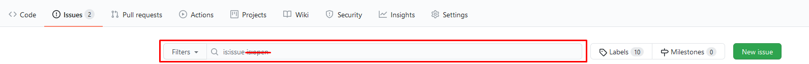

# Avant de contribuer

Avant de contribuer à un projet open source, il faut prendre connaissances de certaines informations.

## 1. Lire le README

Ceci est la toute première chose à faire : lire attentivement le fichier lisez-moi. Il s'agit généralement d'un fichier markdown (dont l'extension est *.md*) ou d'un fichier texte (*.txt*). Il peut également s'agir de tout autre format disposant d'une prévisualisation GitHub, ou non : il peut, par exemple, s'appeller tout simplement *README* sans extension de fichier. La plupart du temps, il est affiché juste en dessous de l'arborescence du projet (prévisualition).

Ce fichier est, comme son nom l'indique, destiné à fournir des informations cruciales sur le projet, telle que son nom, sa finalité, le lien du site web officiel, ou, potentiellement, comment y contribuer.

## 2. Prendre connaissance de la licence du projet

Ce fichier est généralement appelé *LICENSE*, et comme le fichier lisez-moi, il s'agit généralement d'un fichier markdown ou d'un fichier texte, avec ou sans extension.
Le plus souvent, il s'appelle tout simplement *LICENSE* sans extension de fichier.

**S'il n'y a pas de licence, il vaut mieux ne pas contribuer**.
En France, quand un projet n'est pas sous licence, le droit d'auteur s'applique. Vous n'avez donc légalement pas le droit de modifier le code mis à disposition.

Pour connaître les modalités abrégées des licences les plus communes, vous pouvez vous référer à [ce site](https://choosealicense.com/licenses/).

Pour des licences moins connues, vous devrez les lire ou vous renseigner sur Internet (voire contacter un juriste si le texte de la licence est complexe et que vous souhaitez être certain, bien que cela serait certainement disproportionné).

Sur GitHub, si un projet utilise une des licences les plus communes, alors son nom sera indiqué à côté du langage majoritaire.

De même, sur la page du projet, une telle licence verra son nom indiqué dans la section *About* à droite de l'arborescence des fichiers.

## 3. Parcourir les issues

Les *issues* sont des discussions permettant de signaler des bugs, de proposer des modifications telles que de nouvelles fonctionnalités, des améliorations du code source, etc.
Elles peuvent également servir à obtenir du support, ce qui ne nous intéresse pas spécialement ici.

Utilisez la fonctionnalité de recherche pour chercher si une issue portant sur ce que vous souhaitez ajouter ou corriger a déjà été ouverte.

**Cherchez également dans les *issues* fermées**. Enlevez le filtre "is:open" pour rechercher également dans les *issues* fermées.

Malgré ces recherches, il se pourrait que vous n'ayiez pas utilisé les bons mots-clés ou que l'auteur de l'*issue* n'ait pas utilisé des mots-clés significatifs. Dans ce cas, il se pourrait qu'un *maintainer* marque votre *issue* comme dupliquée (par défaut l'étiquette (le *label*) *duplicated*). N'oubliez pas de parcourir les *pull requests* de la même manière afin de réduire ce risque également.

## 4. Parcourir les pull requests

